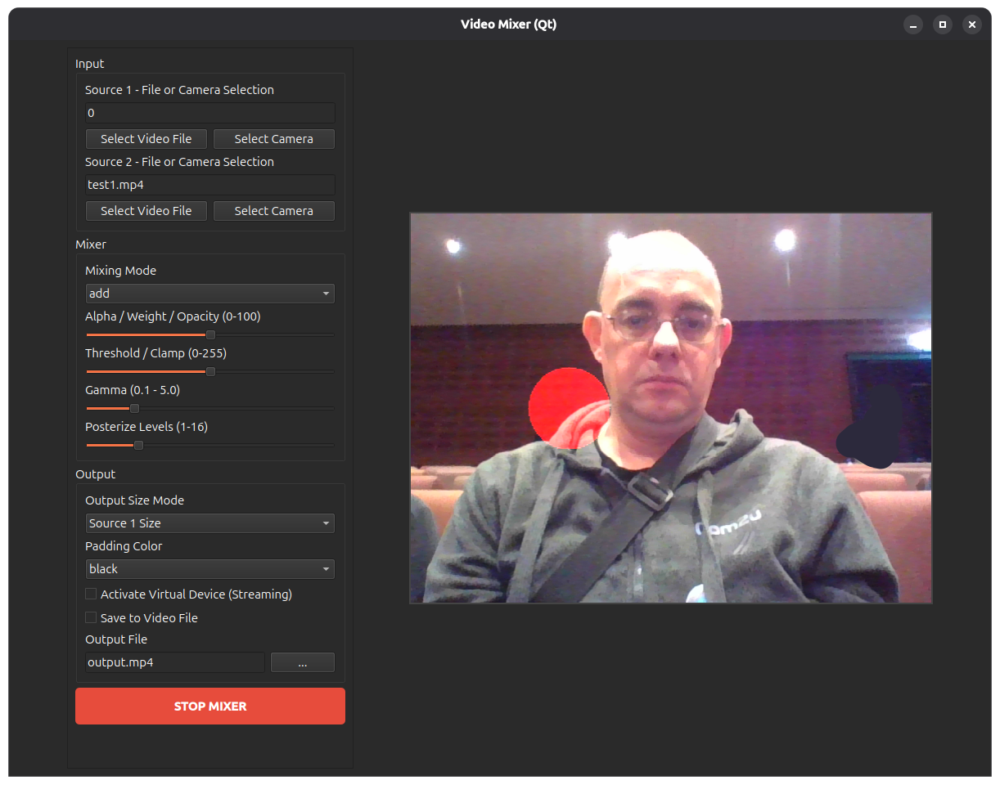

# Video Mixer

A powerful video mixing application that allows you to combine and edit multiple video files.

## Example



## Features

- Mix multiple video files
- Real-time preview
- Easy-to-use GUI interface
- Export mixed videos

## Usage

Run the application with:
```bash
./start.sh
```

Or directly with Python:
```bash
python gui_app.py
```